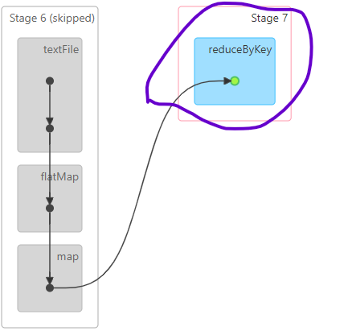
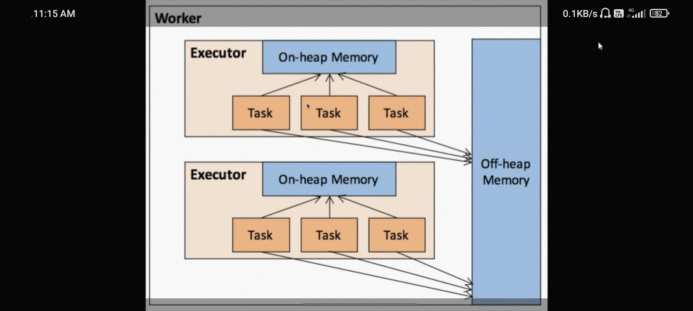
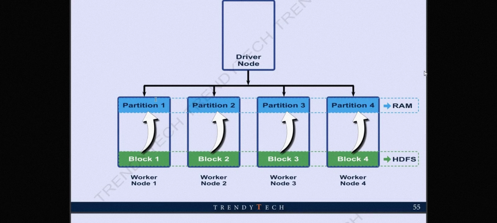

---
layout:
  title:
    visible: true
  description:
    visible: false
  tableOfContents:
    visible: true
  outline:
    visible: true
  pagination:
    visible: true
---

# Spark

## Spark Ecosystem&#x20;

<div align="left">

<figure><figcaption></figcaption></figure>

</div>

## Spark Core

* **In memory -**  \
  MapReduce - take data from disk and saves the output to disk
*   Many MapReduce job , Increase i/o operation

    Spark - all processing is done in memory

    Spark is 10 to 100 times faster than MapReduce .
*   **General Purpose** -\
    In Hadoop we have to use

    Pig for cleaning

    Hive for querying

    Sqoop for data ingestion

    MapReduce  is bound only with map and Reduce
*   **Compute Engine**\
    Hadoop provides 3 things -

    Storage - HDFS

    MapReduce - Compute

    YARN  - Resource manager

    Spark is an alternative to mapReduce.

    It requires storage and manager

    Storage - local, HDFS, S3, blob

    Resource manager -  YARN, Mesos, Kubernetes

### **RDD**

RDD -\
_The basic unit which holds the data in spark is called as RDD._ \
**Resilient**  -  Fault tolerant - its resilient to failures , if we loose RDD, we can recover(create by using graph) it back. It provides fault tolerance through DAG.\
**Distributed**  - RDD is distributed in memory , Files are distributed in file storage.\
**Dataset**.  - Its a big list divided into many machines.\
**Immutable** - We cannot change content of RDD once created, for fault tolerance


```scala
// RDD example
Val rdd1 = Sc.textFile("loadPath")
Rdd2  = Rdd1.flatmap(x => x.split(" ")) // It will give array
Rdd3 = Rdd2.map(x => (x,1))
Rdd4 = Rdd3.reduceByKey((x,y) = > x+y )
Rdd4.Collect()  // To collect the Result
Rdd4.saveAsTextFile("dataFolder")  // To save in a folder, it will always require folderName to save the file

```

saveAsTextFile  - Output of spark will always be a folder.\
Pair RDD - Keys can repeat\
Map - can only have unique keys

### Two Types of operations :

1.  Transformations - Lazy - It creates the DAG\
    why lazy - it will creates suitable execution plan.&#x20;

    1. Narrow Transformation  - no shuffling -> \
       Map, flatmap, filter , MapPartition( works on each partition), count\
       Map is a higher order function - it can call other function\

    2.  Wide Transformation - shuffling -> reduceByKey, groupByKey\
        (Shuffling - move data from one machine to another)\
        \
        GroupByKey Vs ReduceByKey\
        reduceByKey - first it will do local aggregation on single machine and then sent for shuffling.

        Its like a combiner acting at backend.

        Less shuffling involved.\


        GroupByKey - no local aggregation , more shuffling , not performant, **dont use in production**

        One key will be only on one machine -  it can lead to out of memory error\


        &#x20;sortByKey - part of it is eager , it will be shown as a job.\
        rdd.sortByKey(false) - to sort in reverse order\
        sortBy(x => x.\_2) - directly specify key


2. Actions - Eager - It returns the result to driver.\
   call action only at the end, minimize the use of actions\
   collect , saveAstext, Reduce, count

<mark style="background-color:orange;">no of output  = no of input  use map</mark>\ <mark style="background-color:orange;">no of output  > no of input   use flatmap</mark>\ <mark style="background-color:orange;">no of output  <  no of input   use reduce</mark>

### Partitions

Spark Context - sc ->   entry point to run your code on cluster\
sc.defaultParallelism -> 8 as default parallelism\
Spark.sql.files.maxPartitionBytes -> 128 Mib\
spark.sql.shuffle.partitions -> 200\
Rdd.getNumPartitions   ->  To check the number of partition - \
While loading from DBFS -> no of partition = no of executors \
Creating rdd in code using parallelize ->  no of partition=sc.defaultParallelism \
sc.defaultMinPartitions ->  determines the minimum no. Of partition rdd has when we load from file, if partition is less than 2 , it will make 2 partition

<table><thead><tr><th width="331">Repartition</th><th>Coalesce</th></tr></thead><tbody><tr><td>Use to increase or decrease no of partitions</td><td>use to decrease the number of partitions, but it won't give error we try to give higher value </td></tr><tr><td>wide transformation, shuffling involved.</td><td>May not require data shuffling</td></tr><tr><td>Creates even sized partitions</td><td>It will try to combine partition on same machine.</td></tr></tbody></table>

### &#x20;Stages in Spark

Whenever there is shuffle, a new stage gets created.\
whenever we call wide transformation, new stage will be created\
If you use 3 wide transformation - 4 stages will get created.\
Output of  stage 1 will be sent to disk and stage  2 reads it back from disk.  Involves disk I/O operation.\
Minimize stages - use wide transformation at end only.\


<div align="left">

<figure><figcaption><p>Stage Splitting</p></figcaption></figure>

</div>

\
<mark style="background-color:orange;">No of job - no of actions</mark>\ <mark style="background-color:orange;">No of stages - no of wide trasformation  + 1</mark>\ <mark style="background-color:orange;">No of task - no of partition</mark>

**Stage Skipping**\
Action - Whenever you call action - all transformation will be executed. But sometime spark optimize it internally, and hence skip the stages.  It takes output from the previous stage.\
\
Ex. if we call two times collect at the end of program, it will perform entire operation  twice in both the stages.&#x20;

<div align="left">

<figure><figcaption></figcaption></figure>

</div>


**Cache Vs Persist**\
If we want to reuse RDD instead of created again and again \
**Cache** - it will cache in Memory Cache - Rdd.cache() - green color dot , but it will still show the stage \
**Persist** - persist in disk or cache - If you use persist without argument, it is also in memory \
Persist() , Persist(StorageLevel.MEMORY\_ONLY) - same as cache Persist()

<div align="left">

<figure><figcaption><p>caching</p></figcaption></figure>

</div>

<div align="left">

<figure><figcaption><p>Spark Memory</p></figcaption></figure>

</div>

\
Serialization - increases the processing cost but reduce memory foot print.

Persist variants -&#x20;

<table><thead><tr><th width="256">Variants</th><th width="105">Serialized</th><th>Information</th></tr></thead><tbody><tr><td>MEMORY_ONLY</td><td>No</td><td>like cache ,takes more storage</td></tr><tr><td>DISK_ONLY</td><td>Yes</td><td>On Disk</td></tr><tr><td>MEMORY_AND_DISK</td><td>No</td><td>first stored in memory and if space is not there then gets stored at disk . Its widely used in industry. </td></tr><tr><td>OFF_HEAP</td><td>Yes</td><td>blocks are cached in off Heap memory, its unsafe as its outside JVM (Executor)</td></tr><tr><td>MEMORY_ONLY_SER</td><td>Yes</td><td>Serialized data in memory</td></tr><tr><td>MEMORY_AND_DISK_SER</td><td>Yes</td><td>Serialized MEMORY_AND_DISK</td></tr><tr><td>MEMORY_ONLY_2</td><td>No</td><td>2 Replica Stored on different worker node</td></tr></tbody></table>


**Lineage vs DAG**\
Lineage - dependency graph, Logical plan  -RDD.toDebugString  - No action involved\
DAG - you can see DAG when you call action.\
**DAG** (direct acyclic graph) is the representation of the way Spark will execute your program - each vertex(dot)  on that graph is a separate operation (RDD).  and edges(line)  represent dependencies of each operation. Your program (thus DAG that represents it) may operate on multiple entities (RDDs, Dataframes, etc). \
**RDD Lineage** is just a portion of a DAG (one or more operations) that lead to the creation of that particular RDD. \
So, one DAG (one Spark program) might create multiple RDDs, and each RDD will have its lineage (i.e that path in your DAG that lead to that RDD). If some partitions of your RDD got corrupted or lost, then Spark may rerun that part of the DAG that leads to the creation of those partitions.\
If the sole purpose of your Spark program is to create only one RDD and it's the last step, then the whole DAG is a lineage of that RDD.


### Spark Ecosystem


<div align="left">

<figure><figcaption><p>Spark Ecosystem</p></figcaption></figure>

</div>

### Spark Structured API - DataFrame and Dataset

DataFrame - Distributed Table in Spark with named columns.\
Dataset - \
\
**SparkSession** -> Entry point for spark - Enclose all context - \
spark Context, hive context, SQL context.\
_val spark  = SparkSession.builder()_\
_.appName("My Application 1")_\
_.master("local\[2]")_\
_.getOrCreate()_\
\
_spark.close()_\
It will be available as spark. its a singleton , for one Application there will be only one SparkSession.\
Treat your SparkSession as driver.

#### **DataFrame  Reading**

```python
df = spark.read.option("header",true).option("inferSchema", true).csv("path")
df = spark.read.format("csv").option("inferSchema","true").load("/path")
df.show()
```

this involves 3 actions \
1\. read  \
2\. inferSchema \
3\. show

Challenges - \
1\.  DataFrame doesn't offer strongly typed code. we get error at runtime.\
2\. less flexibility than RDD.\
\
If we work with raw RDD by converting DataFrame to RDD, we will loose benefit of catalyst optimizer and tungsten engine.

**DataSet** - \
Provide compile type safety\
More flexibility as RDD\
DataFrame is Dataset of Row Type\
Dataset \[Row] = DataFrame\
Dataset\[Employee] = Dataset of employee type\
Ds  = Df.as\[caseClass]\
\
DataFrame is preferred more than dataset.

Corrupted Records\
PERMISSIVE -  Include corrupt record in separate column - NO process failure , specify \_corrupt\_record column ,Makes All field Null\
DROPMALFORMED - Ignore corrupt Records , No Failure\
FAILFAST - Through Exception if corrupt record , Immediate failure&#x20;

```python
spark.read.format("csv").option("mode","PERMISSIVE").option("header","true").schema(schema).load("/FileStore/data/corruptData.csv")
```

#### **DataFrame Writing**

```python
df.write.format("parquet").mode("append").path("").save()
df.write.format("parquet").mode("append").path("").saveAsTable("Table")
```

Different Writing modes\
\
append - putting file in existing folder\
overwrite - delete the folder and create a new one\
errorIfExists - will give error if output folder already exists\
ignore - if folder exists it will ignore

repartition - df.repartition(4)

\
Distributed RDD Structure

Spark File Layout - How to control file layout\
<mark style="background-color:orange;">No of output files - No of partition in dataset.</mark>\
_Partition Pruning - to skip the partitions._\
**repartition** - control the number of files and file size, Files contain random data. no partition pruning is possible.\
**partitioning** - PartitionBy - column with low cardinality, few distinct values. \
it will create separate folder for each values. you can apply where clause to selected values, partition pruning is possible.\
Each folder will contain no of files same as number of partition.\
option("maxRecordPerFile", 1000)  - restrict the file with definate number of records.\
**bucketing** - BucketBy - Works only on table\
.BucketBy (no\_of\_buckets, "columnName" )\
\
[https://databricks-prod-cloudfront.cloud.databricks.com/public/4027ec902e239c93eaaa8714f173bcfc/4861715144695760/2994977456373837/5701837197372837/latest.html](https://databricks-prod-cloudfront.cloud.databricks.com/public/4027ec902e239c93eaaa8714f173bcfc/4861715144695760/2994977456373837/5701837197372837/latest.html)

**Writing as Table**\
hive metastore - stores the tabular data ->  .saveAsTable("TableName")


